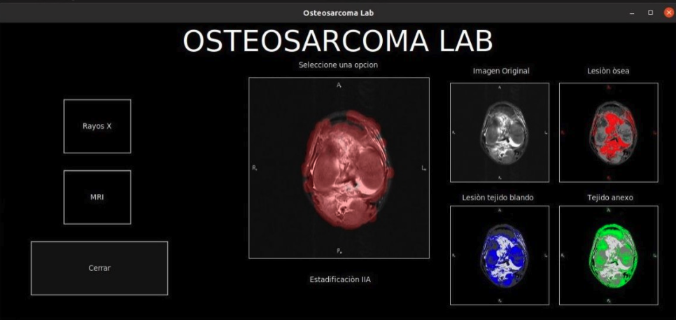

# Predicting Surgical Safety Margins in Osteosarcoma Knee Resections: An Unsupervised Approach

This repository contains the implementation and supplementary materials for the paper:

**Predicting Surgical Safety Margins in Osteosarcoma Knee Resections: An Unsupervised Approach**  
by Carolina Vargas-Ecos and Edwin Salcedo  
📄 [arXiv:2505.06853](https://arxiv.org/abs/2505.06853)  
📍 Accepted at the 6th BioSMART Conference, 2025

## Overview

Osteosarcoma, a prevalent and aggressive bone cancer, poses significant challenges in surgical treatment due to its complex texture and intensity variations. Accurate determination of surgical safety margins is crucial to ensure complete tumor resection while preserving healthy tissue.

This study introduces an unsupervised approach leveraging open-source MRI and X-ray data, digital image processing techniques, and k-means clustering to define tumor boundaries. The methodology aims to estimate confidence intervals for surgical safety margins, facilitating automated, patient-specific surgical planning.

## Features

- **Data Acquisition**: Uses MRI and X-ray images from the open-source repository [https://radiopaedia.org/](https://radiopaedia.org/).
- **Image Processing**: Applies digital techniques to preprocess and enhance medical images.
- **Unsupervised Learning**: Implements k-means clustering to delineate tumor boundaries without labeled data.
- **Margin Estimation**: Calculates confidence intervals for surgical safety margins based on clustered regions.
- **Patient-Specific Analysis**: Provides individualized assessments to support surgical decision-making.

## Getting Started

### Prerequisites

- Python 3.8+
- Required Python packages:
  - numpy
  - pandas
  - scikit-learn
  - matplotlib
  - opencv-python

### Installation

1. Clone the repository:

   ```bash
   $git clone https://github.com/EdwinTSalcedo/OsteosarcomaUCB.git osteosarcoma
   cd osteosarcoma

2. Install dependencies:
   ```bash
    $pip install -r requirements.txt
    ```

Usage
1. Prepare your dataset:

    - Place MRI and X-ray images in the data/ directory.

2. Run the User Interface:

```bash
$python gui.py 
```

You will obtain a inteface similar to this one: 



## Results
The proposed method demonstrates potential in accurately estimating surgical safety margins, aligning with clinical requirements for complete tumor resection while minimizing healthy tissue removal. Detailed results and evaluations are presented in the paper.

## Acknowledgments
We acknowledge the use of open-source medical imaging datasets and the support from the Universidad Católica Boliviana “San Pablo”.

## Citation

If you find this project useful for your project, consider citing the following paper. 

```
@article{vargas2025,
  title={Predicting Surgical Safety Margins in Osteosarcoma Knee Resections: An Unsupervised Approach},
  author={Vargas-Ecos, Carolina and Salcedo, Edwin},
  journal={arXiv preprint arXiv:2505.06853},
  year={2025}
}
```